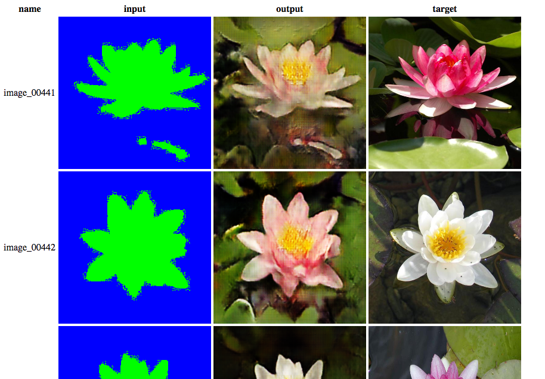
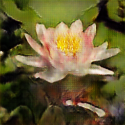

# 休暇をとって、ソフトウェア開発のことを忘れて、丘の上の別荘で花畑を見ながらキャンバスに絵を描きたい

## 動作確認環境

- Mac mini(Late 2014) macOS sierra
- Python 3.6.2

## 依存ライブラリ

- OpenCV
- pip 
  - numpy scipy pydot keras matplotlib h5py tensorflow pillow
  - バージョンは(./pip_list.txt)[./pip_list.txt]を参照。

## ブラウザでの表示まで

### 1. 準備

```
# 利用するpix2pix-tensorflowとfast-style-transferのcloneとフォルダを作成をする。
setup.sh
```

### 2. 学習用のデータを取得する

[102 Category Flower Dataset](http://www.robots.ox.ac.uk/~vgg/data/flowers/102/)のDataset images("102flowers.tgz)", Image segmentations("102segmentations.tgz") and The image labels("imagelabels.mat")をダウンロードして`./pix2pix_train_data/orig/`以下に展開する。

```
imagelabels.mat
jpg/
segmim/
```

### 3. pix2pixの学習用にデータを修正する

ダウンロードした画像を修正してpix2pixの学習用の画像を作成する。

```bash
./translate_train_data.py
```

していることは下記。

- "imagelabels.mat"の情報を元に、睡蓮、バラ、ひまわりの画像を抜き出す。
- 256x256にリサイズする。
- "segmim"フォルダの画像はセグメント画像であり、花以外が青画像になっているので、青以外の領域(花の部分)を花の種類に応じた色で塗りつぶす(睡蓮: 緑、バラ: 赤、ひまわり: 黄色)。
- 変換前画像(色で塗りつぶし画像)と変換後の画像(元の花画像)を横並びに結合して、512x256の訓練画像として保存する。ただし、花の種類ごとに5枚だけテスト用画像として別に保存する。

下記が作成される。
```
pix2pix_train_data/orig/train # 訓練画像。変換前と変換後の画像を結合した画像。学習に利用する。
pix2pix_train_data/orig/test # テスト画像。変換前と変換後の画像を結合した画像。学習に利用しない。
pix2pix_train_data/orig/val # 変換テスト用の画像。テスト画像の変換前画像。
```

作成された訓練画像の例。学習させたい変換の変換前を右にして変換後を左にする。


ここでの訓練画像は411枚と少ないので通常は各種変換をした画像で水増しするケースが多いが、今回はDNNのシンプルな例なのでしない。

### 4. pix2pixで学習させる

```bash
python pix2pix-tensorflow/pix2pix.py \
  --mode train \
  --output_dir ./pix2pix_train_result \
  --max_epochs 200 \
  --save_freq 2000 \
  --input_dir ./pix2pix_train_data/train \
  --which_direction BtoA
```

学習状況はtensorboardで確認できる。

```bash
{tensorflowを入れた場所}/tensorboard --logdir=./pix2pix_train_result
```

tensorboardの`SCALARS`や`IMAGES`を見て、求めている変換ができてそうならば、Ctrl-cで学習を止めていい。5000stepごとにmodelは自動保存されている。レジューム等の方法はpix2pix.pyのオプションを参照。

### 5. 学習経過の画像を確認する(オプショナル)

途中経過の画像を800個まで見たい場合のみ実行。

```bash
mkdir pix2pix_train_result_images
python export_pix2pix_train_result_images.py --event_file {イベントファイル名} --output_dir pix2pix_train_result_images
```

### 6. 学習結果をテスト画像で評価する

学習に利用した画像ではないので、本来の変換の精度が確認できる。

```bash
python pix2pix-tensorflow/pix2pix.py \
  --mode test \
  --output_dir ./pix2pix_test_result \
  --input_dir ./pix2pix_train_data/test \
  --checkpoint ./pix2pix_train_result
```

[./pix2pix_test_result/index.html](./pix2pix_test_result/index.html)を開くと結果が確認できる。

82200stepまで学習した場合の結果の例


### 7. 学習済みモデルをエキスポートする

学習結果などとまとめたれたcheckpointからモデルを取り出して保存する。

```bash
python pix2pix-tensorflow/pix2pix.py \
  --mode export \
  --output_dir ./pix2pix_models/flower1 \
  --checkpoint ./pix2pix_train_result
```

pix2pix_modelsの下のフォルダ名がサーバーとしてのURLにマッピングされるモデルの識別子(この場合"flower1")になることに注意。

### 8. 取り出した学習済みモデルで変換を試す

```bash
python pix2pix-tensorflow/server/tools/process-local.py \
  --model_dir ./pix2pix_models/flower1 \
  --input_file ./pix2pix_train_data/val/image_00441.png \
  --output_file ./output.png
```

output.png


### 9. 変換用のサーバーを動作させてクライアントから変換リクエストをする

```bash
# 変換サーバの起動。ブラウザからの利用したいのでoriginを全ての場所から許可する。
python pix2pix-tensorflow/server/serve.py \
  --origin '*' \
  --local_models_dir ./pix2pix_models

# 別のシェルで変換サーバへのflower1モデルに対して変換を依頼
python pix2pix-tensorflow/server/tools/process-remote.py \
    --input_file ./pix2pix_train_data/val/image_00441.png \
    --url http://localhost:8000/flower1 \
    --output_file output.png
```

### 10. ブラウザから変換サーバを利用する

上記のサーバが起動している状態で[./static/index.html](./static/index.html)を開く。

描画して"Flowerize"ボタンを押すと、変換サーバに変換元画像が送信され、変換サーバから返された画像を表示する。


## ついでに画風変換もする

### 1. 画風変換でゴッホの画風を学習したモデルを作る

```bash
# カレントディレウトリがfast-style-transferでないと動かないようなので移動
cd fast-style-transfer

# COCOの画像を取得するので時間がかかる
./setup.sh

# 学習させる。テスト画像はひまわり
python style.py --style ../fast_style_transfer_style_imgs/goph.jpg \
  --checkpoint-dir ../fast_style_transfer_train_result \
  --test ../pix2pix_train_data/orig/jpg/image_05413.jpg \ # ひまわり画像でテスト
  --test-dir ../fast_style_transfer_train_test_result \
  --content-weight 1.5e1 \
  --checkpoint-iterations 100 \
  --batch-size 20

TODO: remove
python style.py --style goph.jpg \
  --checkpoint-dir fast_style_transfer_train_result \
  --test image_for_style_test.png \
  --test-dir fast_style_transfer_train_test_result \
  --content-weight 1.5e1 \
  --checkpoint-iterations 100 \
  --batch-size 20
```

TODO: 画像

## 2. 学習したモデルを評価する

```bash
# カレントディレウトリがfast-style-transferでないと動かないようなので移動
cd fast-style-transfer

python evaluate.py --checkpoint ../fast_style_transfer_train_result/fns.ckpt \
  --in-path ../pix2pix_train_data/test \
  --out-path ../fast_style_transfer_test_result

TODO: remove

python evaluate.py --checkpoint ../style_checkpoint/fns.ckpt \
  --in-path ../pix2pix_train_data/test \
  --out-path ../fast_style_transfer_test_result

python evaluate.py --checkpoint ../style_checkpoint/fns.ckpt \
  --in-path ../server_test \
  --out-path ../fast_style_transfer_test_result

```

TODO: 画像

## 3. 色は変換前の画像のものを使う

fast-style-transferは変換後の画像の色もスタイル画像に近い形になるが、今回は色は変換前のままがいいので、YUV色空間でY(輝度)のみ変換後の画像にして、UVは変換前の画像のものを使うことで、色だけ変換前に戻す。

```bash
python restore_color.py --y_file fast_style_transfer_test_result/image_00441.png \
  --uv_file pix2pix_train_data/test/image_00441.png \
  --out_file restore_color_test.png
```

TODO: 画像

## 4. fast-style-transferのサーバを起動する

```bash
fast_style_transfer_server.py

```
